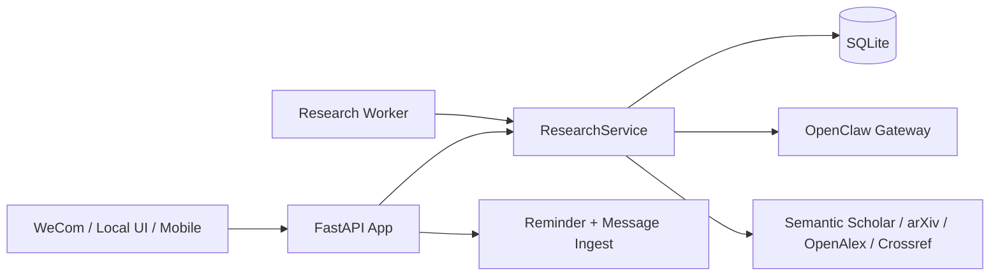

<div align="center">

# OpenClaw for Paper Research

本地优先的研究工作流与个人助理原型，围绕 OpenClaw 构建文献规划、轮次探索、全文处理、引文图谱和轻量提醒能力。

<p>
  <a href="https://github.com/AusungSi/OpenClaw-for-paper-research/stargazers"></a>
  
  
  
  
</p>

</div>

> [!NOTE]
> 这个仓库不只是“文献搜索脚本”，而是一套从 OpenClaw 调研规划到本地研究 UI、异步 worker、WeCom 入口、移动端配对和后台审计的完整原型。

> [!TIP]
> WSL research-local 主线请优先查看 `docs/RESEARCH_LOCAL_QUICKSTART.md` 和 `docs/README.md`。

## Overview

`OpenClaw for Paper Research` 的核心目标，是把“找论文”升级为“围绕主题持续收敛研究方向”的工作流：

- 用 OpenClaw 生成研究方向和摘要任务
- 用多轮探索替代一次性搜索
- 用全文抓取、手动上传和引文扩展补齐证据链
- 用本地可视化界面把 Topic / Direction / Round / Paper 串成可迭代的研究树

除了 research 模块，仓库还保留了提醒助手、企业微信消息入口、语音转写、移动端 token 配对，以及 localhost-only 的管理页面，方便你把 research 能力接入更大的个人助手系统。

## Core Capabilities

- OpenClaw 驱动的研究方向规划、摘要生成与关键点总结
- 轮次式探索：`expand / deepen / pivot / converge / stop`
- 论文检索、保存、导出与分页浏览
- 全文自动下载、PDF 上传补齐、PyMuPDF + pdfminer 解析
- 按需构建 1-hop 引文图，支持 `semantic_scholar -> openalex -> crossref` 兜底
- 基于 `research_jobs` 的异步队列，支持 worker claim / lease / heartbeat / reclaim
- 企业微信文本与语音入口、提醒落库和调度分发
- 本地管理台、开发 token 接口和用户审计页

## Research Workflow


## Architecture at a Glance



## Repository Structure

```text
OpenClaw-for-paper-research/
├── app/
│   ├── api/          # wechat, mobile, health, research, admin, research_ui
│   ├── core/         # config, logging, timezone
│   ├── domain/       # enums, models, schemas
│   ├── infra/        # db session, repos, wecom clients
│   ├── llm/          # openclaw / ollama clients and providers
│   ├── services/     # reminder, ingest, research and admin services
│   └── workers/      # dispatcher and research worker
├── docs/             # demo steps and architecture notes
├── scripts/          # PowerShell startup/testing helpers
├── tests/            # unit + integration tests
├── .env.example
├── requirements.txt
└── README.md
```

Additional current directories worth noting:

- `frontend/`: Vite + React research workbench
- `scripts/`: now includes WSL startup, build and packaging helpers
- `requirements-research-local.txt`: trimmed dependency set for the research-local profile

## Quick Start

### 1. Clone and install

```powershell
git clone https://github.com/AusungSi/OpenClaw-for-paper-research.git
cd OpenClaw-for-paper-research
python -m venv .venv
. .\.venv\Scripts\Activate.ps1
pip install -r requirements.txt
```

### 2. Create your local config

```powershell
Copy-Item .env.example .env
```

建议至少检查这些变量：

- `OPENCLAW_ENABLED=true`
- `OPENCLAW_BASE_URL=http://127.0.0.1:18789`
- `OPENCLAW_GATEWAY_TOKEN=<your-token>`
- `RESEARCH_ENABLED=true`
- `RESEARCH_QUEUE_MODE=worker`
- `DB_URL=sqlite:///./memomate.db`

如果你只想先跑本地 research UI，企业微信相关变量可以暂时保留占位值。

### 3. Start the backend

```powershell
.\scripts\start_backend.ps1
```

等价的手动命令是：

```powershell
python -m uvicorn app.main:app --host 0.0.0.0 --port 8000
```

### 4. Start the research worker

```powershell
.\scripts\start_research_worker.ps1
```

或者一键同时启动：

```powershell
.\scripts\start_all_with_worker.ps1
```

### 5. Open the local research UI

- Research UI: `http://127.0.0.1:8000/research/ui`
- Health check: `http://127.0.0.1:8000/api/v1/health`
- Capabilities: `http://127.0.0.1:8000/api/v1/capabilities`
- Admin overview: `http://127.0.0.1:8000/admin`

本地开发时，研究 UI 可以通过 `localhost-only` 的 `/api/v1/dev/token` 自动拿到调试 token。

## API Highlights

### Research

- `POST /api/v1/research/tasks`
- `GET /api/v1/research/tasks`
- `POST /api/v1/research/tasks/{task_id}/plan`
- `POST /api/v1/research/tasks/{task_id}/search`
- `POST /api/v1/research/tasks/{task_id}/explore/start`
- `POST /api/v1/research/tasks/{task_id}/explore/rounds/{round_id}/propose`
- `POST /api/v1/research/tasks/{task_id}/explore/rounds/{round_id}/select`
- `POST /api/v1/research/tasks/{task_id}/fulltext/build`
- `POST /api/v1/research/tasks/{task_id}/graph/build`
- `POST /api/v1/research/tasks/{task_id}/papers/{paper_id}/summarize`
- `GET /api/v1/research/tasks/{task_id}/graph/view`

### Assistant and ops

- `GET/POST /wechat`
- `POST /api/v1/auth/pair`
- `GET /api/v1/reminders`
- `POST /api/v1/asr/transcribe`
- `GET /api/v1/admin/overview`
- `POST /api/v1/admin/chat/send`

## Development Notes

- `docs/README.md` 给出了 docs 目录的整理索引和主要入口。
- `docs/PROJECT_OVERVIEW_ZH.md` 适合做中文接手文档。
- `docs/design/前端示例.canvas` 保存了前端视觉参考样例。

- `docs/RESEARCH_ARCH.md` 解释了研究任务、轮次、引文边和队列模型的设计。
- `docs/DEMO_STEPS.md` 给出了从启动到演示的完整本地操作流程。
- `/admin`、`/api/v1/admin/*` 和 `/api/v1/dev/*` 都限制为 localhost 访问，适合本地调试和验收。
- `RESEARCH_WECOM_LITE_MODE=true` 时，企业微信只承担轻量入口和状态通知，复杂研究操作仍在本地 UI 完成。

## Testing

```powershell
python -m pytest -q
```

测试覆盖了 research API、队列 reclaim、OpenClaw client、提醒流程、语音消息、管理台和移动端配对等主路径。
